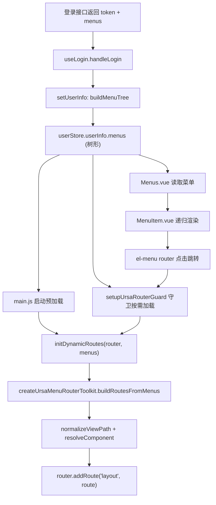
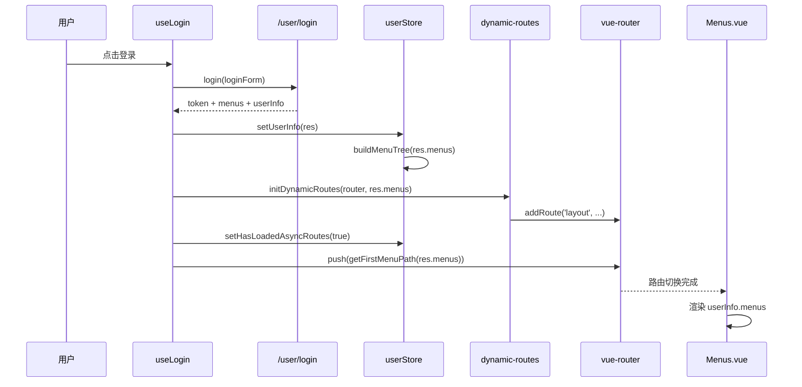

# ursacomponents 菜单生成流程与代码说明（基于当前项目实现）

> 更新时间：2026-03-20  
> 适用项目：vue-admin（依赖同级组件库 ursacomponents）

## 1. 文档目标

本文聚焦“菜单如何生成并驱动路由与页面展示”，覆盖两层代码：

1. 项目层（vue-admin）：登录、菜单入库、动态路由注入、侧边菜单渲染。
2. 组件库层（ursacomponents）：通用菜单路由工具与通用路由守卫。

文档输出包括：

1. 全链路流程图
2. 关键时序图
3. 关键文件逐个说明
4. 菜单字段要求与排查清单

---

## 2. 先看全景架构



一句话总结：同一份 menus 数据，同时驱动“左侧菜单展示”和“动态路由注入”。

---

## 3. 关键文件清单与职责

## 3.1 vue-admin（业务项目）

1. src/composables/useLogin.js
- 登录成功后写入 token、用户信息、动态注入路由并跳转首菜单。

2. src/stores/user.js
- 维护用户状态（userInfo）。
- 将后端 menus 转成树结构并持久化。
- 维护 hasLoadedAsyncRoutes，避免重复注入。

3. src/utils/menu.js
- buildMenuTree：扁平转树。
- flattenMenus：树转扁平。
- getFirstMenuPath：登录后首跳路径。

4. src/main.js
- 应用启动时，如果持久化里已有 menus，先预加载动态路由。

5. src/router/index.js
- 使用 setupUrsaRouterGuard 注入通用守卫。
- 传入 getToken/getUserStore/initDynamicRoutes 等参数。

6. src/router/dynamic-routes.js
- 创建并导出路由工具：buildRoutesFromMenus、initDynamicRoutes。
- 提供 getMenuIcon（实际调用 getUrsaMenuIcon）。

7. src/layout/Menus.vue
- 读取 userInfo.menus，过滤 hidden 后作为根菜单渲染。

8. src/layout/MenuItem.vue
- 递归渲染菜单节点。
- 调用 getMenuIcon 动态渲染图标。

## 3.2 ursacomponents（组件库）

1. ../ursacomponents/src/router/index.js
- createUrsaMenuRouterToolkit：核心菜单转路由工具。
- setupUrsaRouterGuard：通用鉴权 + 按需动态路由守卫。
- getUrsaMenuIcon：图标名到组件映射。

2. ../ursacomponents/src/index.js
- 对外统一导出路由工具和通用组件。

---

## 4. 菜单数据的“输入规范”

当前链路下，单个菜单项建议至少包含：

```js
{
  id: 1001,
  parent_id: 0,
  path: '/dashboard',
  component: 'dashboard/index',
  name: 'dashboard',
  menu_name: '首页',
  icon: 'House',
  hidden: false,
  meta: {
    title: '首页',
    icon: 'House',
    hidden: false
  },
  children: []
}
```

字段说明：

1. path
- 菜单跳转路径。
- 在路由构建时会转成 layout 子路由 path（去掉前导 /）。

2. component
- 对应 views 下页面路径，不含 .vue 也可以。
- 例如 dashboard/index 会被规范成 /src/views/dashboard/index.vue 进行匹配。

3. name
- 路由名，可选但建议提供。
- 缺失时组件库会按 path 生成 fallbackName。

4. menu_name / meta.title
- 菜单显示标题与路由 meta 标题来源。

5. icon / meta.icon
- 菜单图标来源。

6. hidden / meta.hidden
- 控制菜单和路由是否隐藏。

---

## 5. 详细流程说明

## 5.1 首次登录流程



关键点：

1. useLogin 中用的是 res.menus 做动态路由注入（原始返回）。
2. store 中保存的是 buildMenuTree 后的树（用于 UI）。
3. 两边都来自同一份后端菜单，职责不同：
- 注入路由关注 component/path。
- 菜单展示关注 children 层级和 hidden/icon/title。

## 5.2 刷新恢复流程

1. Pinia 持久化先恢复 userInfo 和 hasLoadedAsyncRoutes。
2. main.js 在 app.mount 前检查 userInfo.menus：
- 如果有 menus，先执行 initDynamicRoutes 预加载。
- 然后 setHasLoadedAsyncRoutes(true)。
3. router/index.js 里的 setupUrsaRouterGuard 仍会兜底：
- 当 hasLoadedAsyncRoutes 为 false，或目标路由缺失时，再次动态注入。
- 注入后使用 replace 重进当前目标。

这形成“双保险”：

1. main.js 提前注册（减少首次跳转等待）。
2. 路由守卫兜底注册（防止状态不一致导致空白页）。

## 5.3 菜单点击跳转流程

1. Menus.vue 使用 el-menu router。
2. MenuItem.vue 把 menu.path 作为 index。
3. 点击后 vue-router 导航。
4. setupUrsaRouterGuard 判断是否需要补注入路由。
5. 路由命中后渲染对应 views 页面。

---

## 6. 代码说明（逐文件）

## 6.1 src/composables/useLogin.js

核心职责：登录后一次性完成“鉴权态 + 用户态 + 路由态”的初始化。

关键逻辑：

1. setToken(res.token)
- 持久化登录态。

2. setUserInfo(res)
- 把后端返回写入 store。
- 内部会调用 buildMenuTree。

3. initDynamicRoutes(router, res.menus)
- 登录成功立刻注入业务路由。

4. setHasLoadedAsyncRoutes(true)
- 标记已注入，供守卫判断。

5. router.push(getFirstMenuPath(res?.menus))
- 登录后首跳到第一个可用菜单。

## 6.2 src/stores/user.js

核心职责：用户信息与菜单状态管理。

关键点：

1. getDefaultUserInfo
- 提供统一默认结构，便于重置。

2. setUserInfo(user)
- 合并用户信息。
- menus 使用 buildMenuTree(user?.menus) 转树。

3. hasLoadedAsyncRoutes
- 防重复注入动态路由的重要状态位。

4. persist: true
- 刷新后仍能恢复用户信息与菜单。

## 6.3 src/utils/menu.js

核心职责：菜单结构转换与首跳路径提取。

1. buildMenuTree(menus)
- 容错处理：空数组/非法数据直接返回空。
- 先 collectMenus 拉平成 flatMenus。
- 再用 id -> menuMap 建索引并重建 parent/children。
- 最后按 sort_no 递归排序。

2. flattenMenus(menus)
- 深度优先拍平树结构。
- 会移除 children 字段，仅保留当前层属性。

3. getFirstMenuPath(menus)
- 取拍平后第一个有 path 的菜单。
- 无结果时回退 /dashboard。

## 6.4 src/main.js

核心职责：应用启动期预加载动态路由。

关键逻辑：

1. 读取 userStore.userInfo?.menus。
2. menus 非空时，调用 initDynamicRoutes(router, menus)。
3. 设置 hasLoadedAsyncRoutes 为 true。

价值：减少刷新后首跳时由守卫触发的“补注册等待”。

## 6.5 src/router/index.js

核心职责：路由实例与守卫接入。

关键点：

1. 静态路由只保留 /login 与 /（layout 壳）。
2. setupUrsaRouterGuard 注入守卫。
3. 通过 options 注入项目自定义能力：
- getToken
- getUserStore
- initDynamicRoutes
- loginPath
- debug

即：守卫机制通用化，业务逻辑参数化。

## 6.6 src/router/dynamic-routes.js

核心职责：在项目侧“配置化创建” ursa 路由工具。

关键逻辑：

1. import.meta.glob('@/views/**/*.vue')
- 扫描页面组件懒加载映射。

2. createUrsaMenuRouterToolkit({...})
- 传入 viewModules、flattenMenus、viewsDir、debug。

3. 导出 buildRoutesFromMenus 与 initDynamicRoutes
- 供 login、main、router guard 复用。

4. getMenuIcon(iconName)
- 调用 getUrsaMenuIcon 做图标映射。

## 6.7 src/layout/Menus.vue

核心职责：根菜单渲染入口。

关键逻辑：

1. useMenus() 读取 userInfo。
2. visibleMenus = userInfo.value?.menus?.filter(menu => !menu.hidden) || []。
3. v-for 渲染 MenuItem。

## 6.8 src/layout/MenuItem.vue

核心职责：单节点递归渲染。

关键逻辑：

1. hasChildren 判定渲染 el-sub-menu 或 el-menu-item。
2. menuTitle 优先 menu_name。
3. menuIcon 优先 meta.icon，其次 icon，再兜底默认图标。

---

## 7. ursacomponents 内部实现说明

## 7.1 createUrsaMenuRouterToolkit（../ursacomponents/src/router/index.js）

该方法返回 5 个核心能力：

1. normalizeViewPath
- 规范组件路径：去前导 /、补 .vue 后缀。

2. resolveComponent
- 按 viewsDir + viewPath 生成 key，在 viewModules 中找对应懒加载函数。

3. mapMenuToRoute
- 把菜单项映射为 Vue Router record。
- 自动构建 meta.title/icon/hidden。
- 缺少 name 时自动给 fallbackName。

4. buildRoutesFromMenus
- 使用 flattenMenus（可注入）对菜单预处理。
- 批量 map + filter(Boolean)。

5. initDynamicRoutes
- 对每条 route 做 hasRoute 判断，避免重复 addRoute。
- 默认挂在 parentRouteName = layout。

## 7.2 setupUrsaRouterGuard（../ursacomponents/src/router/index.js）

守卫逻辑顺序：

1. 放行登录页（to.path === loginPath）。
2. 无 token 跳登录页。
3. 计算 needLoadRoutes：
- 默认条件：未加载过，或 to.matched 为空，或 to.name 对应路由不存在。
- 也支持 shouldLoadRoutes 自定义覆盖。
4. needLoadRoutes 为 true 时：
- 从 store 取 menus。
- 有菜单则 initDynamicRoutes + setLoadedRoutes(true) + next({...to, replace:true})。
- 无菜单则回退 loginPath（可用 onMissingMenus 自定义）。

这个守卫把“鉴权 + 动态路由补齐 + 失败回退”统一收敛到一个通用实现。

## 7.3 getUrsaMenuIcon

逻辑很简单：

1. 先从 iconMap 里按 iconName 取。
2. 取不到则 fallbackIcon（默认 Menu）。
3. 再取不到则兜底 ElementPlusIconsVue.Menu。

---

## 8. 为什么当前实现稳定

主要来自三层幂等与兜底：

1. 路由注入幂等
- initDynamicRoutes 内部 hasRoute 判断防止重复注入。

2. 启动与守卫双注入入口
- main.js 预加载。
- setupUrsaRouterGuard 按需补加载。

3. 菜单展示容错
- visibleMenus 空值兜底。
- menuTitle/menuIcon 都有回退策略。

---

## 9. 常见问题与排查流程

## 9.1 菜单显示了但点不开页面

按顺序检查：

1. 后端菜单项是否包含 path + component。
2. component 是否能映射到 src/views 下真实 .vue 文件。
3. dynamic-routes.js 的 viewsDir 是否与项目结构一致（当前是 /src/views）。
4. 是否有重复 route.name 导致 hasRoute 判重后未注入新路由。
5. 控制台 debug 日志里是否有 viewModules 中不存在该路径 警告。

## 9.2 刷新后偶发白屏或回登录

1. 检查 token 是否有效（useAuth）。
2. 检查 userStore 持久化是否恢复了 menus。
3. 检查 hasLoadedAsyncRoutes 与实际 router 状态是否一致。
4. 检查守卫里是否触发了 next({...to, replace:true})。

## 9.3 图标不显示

1. menu.meta.icon 或 menu.icon 是否为 Element Plus 图标组件名。
2. getUrsaMenuIcon 是否命中。
3. 命不中时是否回退到默认 Menu（可用于判定是“无图标”还是“图标名错误”）。

---

## 10. 可改进建议（可选）

1. 增加菜单数据校验器
- 登录后立即校验 path/component/name 合法性并输出结构化日志。

2. 统一 menus 来源
- 当前登录注入使用 res.menus，菜单展示使用 store.buildMenuTree 后数据。
- 可考虑在一个标准化函数中统一输入输出，减少两处口径差异。

3. 子菜单 hidden 过滤下沉
- 目前根菜单在 Menus.vue 过滤 hidden。
- 可在 MenuItem.vue 继续过滤 children 中 hidden 项，保持展示规则一致。

4. debug 开关按环境控制
- 开发环境打开，生产环境关闭。

---

## 11. 总结

本项目已完成“菜单驱动路由”的通用化改造：

1. 业务层负责传入项目上下文（viewModules、store、token、loginPath）。
2. 组件库层负责复用机制（菜单转路由、鉴权守卫、图标映射）。
3. 最终达到：
- 登录即生效
- 刷新可恢复
- 菜单与路由同源
- 重复注入可避免

这套方案适合继续扩展 RBAC 场景，也便于将菜单路由能力沉淀为团队统一规范。