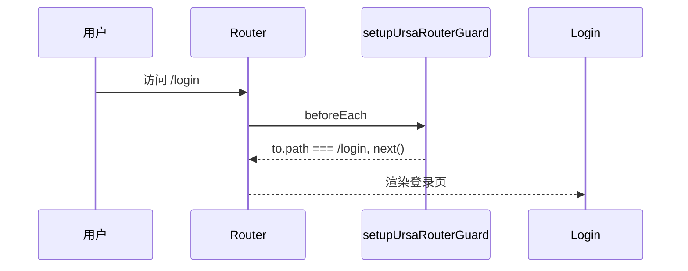
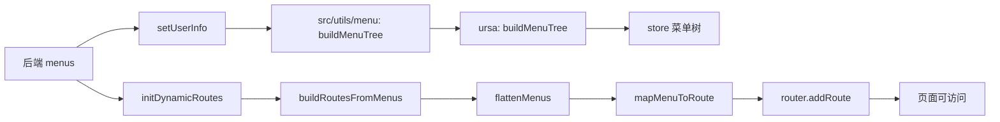

# 菜单调用链（vue-admin + ursacomponents）

本文基于当前项目结构（`buildMenuTree` 等已抽离到 `ursacomponents`）梳理菜单调用链，分为 3 个阶段：

1. vue 启动时
2. 登录页
3. 登录之后

---

## 0. 当前结构先说明

### 0.1 实现归属

- `src/utils/menu/menu.js`
  - 现在是业务侧“委托层”（wrapper），不再包含核心实现。
  - `buildMenuTree`、`getFirstMenuPath` 都是转调 `ursacomponents`。
- `node_modules/ursacomponents/src/router/modules/menu.js`
  - 菜单相关核心实现所在：`flattenMenus`、`buildMenuTree`、`getFirstMenuPath`。
- `node_modules/ursacomponents/src/router/modules/toolkit.js`
  - 动态路由核心：`buildRoutesFromMenus`、`initDynamicRoutes`。
- `node_modules/ursacomponents/src/router/modules/guard.js`
  - 路由守卫核心：`setupUrsaRouterGuard`。

### 0.2 关键职责

- `buildMenuTree`：把菜单重建为树结构（用于 store 和菜单展示）。
- `flattenMenus`：把树拍平（用于路由映射/首菜单路径选择）。
- `buildRoutesFromMenus`：菜单项映射为 Vue Router 路由记录。
- `initDynamicRoutes`：把映射后的路由动态注入 `router`。

---

## 1. vue 启动时

### 1.1 调用链

```mermaid
flowchart TD
  A[main.js 启动] --> B[import router]
  B --> C[router/index.js]
  C --> D[import initDynamicRoutes from dynamic-routes.js]
  D --> E[createUrsaMenuRouterToolkit]
  E --> F[得到 buildRoutesFromMenus/initDynamicRoutes]
  C --> G[setupUrsaRouterGuard 注册 beforeEach]
  A --> H[读取 userStore.userInfo.menus]
  H --> I{menus.length > 0}
  I -- 是 --> J[main.js 调 initDynamicRoutes(router, menus)]
  I -- 否 --> K[不预加载, 等登录或守卫按需加载]
```

### 1.2 细节说明

- `createUrsaMenuRouterToolkit` 在模块加载时执行，不需要等用户点击登录。
- 启动阶段若 `Pinia persist` 恢复到历史菜单，会在 `main.js` 里先执行一次动态路由注入。
- 若没有历史菜单，则由登录成功逻辑或守卫按需注入。

---

## 2. 登录页

### 2.1 调用链



### 2.2 细节说明

- `/login` 在守卫里是白名单放行。
- 这个阶段通常只展示登录页，不做菜单构建。
- 菜单构建与动态路由注入发生在“登录成功后”。

---

## 3. 登录之后

### 3.1 主调用链（最关键）

```mermaid
flowchart TD
  A[useLogin.handleLogin] --> B[login API 返回 res.token + res.menus]
  B --> C[setToken]
  B --> D[setUserInfo(res)]
  D --> E[src/utils/menu/buildMenuTree]
  E --> F[转调 ursa buildMenuTree]
  F --> G[store.userInfo.menus 成为树结构]

  B --> H[initDynamicRoutes(router, res.menus)]
  H --> I[buildRoutesFromMenus]
  I --> J[flattenMenus]
  J --> K[mapMenuToRoute]
  K --> L[router.addRoute('layout', route)]

  L --> M[setHasLoadedAsyncRoutes(true)]
  M --> N[getFirstMenuPath(res.menus)]
  N --> O[src/utils/menu/getFirstMenuPath]
  O --> P[转调 ursa getFirstMenuPath]
  P --> Q[router.push(firstPath)]
```

### 3.2 两条通道（必须区分）

- 通道 A（菜单展示通道）
  - `setUserInfo` -> `buildMenuTree`（ursa 实现）-> `store.userInfo.menus`（树结构）。
  - 服务对象：左侧菜单、标签页等 UI。
- 通道 B（路由可访问通道）
  - `initDynamicRoutes` -> `buildRoutesFromMenus` -> `router.addRoute`。
  - 服务对象：页面访问能力（地址可匹配、可跳转）。

### 3.3 登录后守卫兜底

即使遗漏了手动注入，守卫也会在导航时检查：

- 是否已加载过动态路由（`hasLoadedAsyncRoutes`）。
- 目标路由是否存在（`to.matched` / `router.hasRoute`）。

若未加载且有菜单，守卫会补调 `initDynamicRoutes`，并 `next({ ...to, replace: true })` 立即生效。

---

## 4. 一图总览



---

## 5. 可记忆版结论

- 启动时：工具箱初始化 + 守卫注册 + 有持久化菜单则预加载路由。
- 登录页：守卫放行 `/login`。
- 登录后：
  - `buildMenuTree`（已在 `ursacomponents`）负责菜单树。
  - `buildRoutesFromMenus/initDynamicRoutes`（`ursacomponents`）负责动态路由。
  - `src/utils/menu` 负责业务层统一入口与委托。
